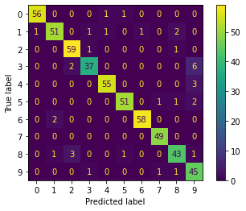
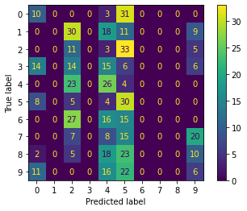
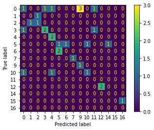
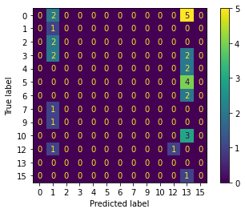

# Enunciado
> Realizar una evaluación comparativa entre DT y ANN utilizando dos conjuntos de datos: uno de imágenes (sin extracción de rasgos) y otro de atributos numéricos.
Las métricas a utilizar deben ser:
> - Exactitud (Accuracy)
> - Precisión (Precision)
> - Exhaustividad (Recall)
> - F-score
> - Kappa
> - Matriz de confusión

## Ficheros
* [Ejemplo DL visto en clase](examples/dl_xample.py)

**Dataframe de imágenes**

* [dt.py](images_analysis/dt.py)
* [ann.py](images_analysis/ann.py)

**Dataframe de atributos númericos**

* [dt.py](numeric_analysis/dt.py)
* [ann.py](numeric_analysis/ann.py)

## Desarrollo

### Utilizando conjunto de datos con imagenes
Están en: `/images_analysis`

**Resultados**
|           	| Neuronal Networks  	| Decision Tree      	|
|-----------	|--------------------	|--------------------	|
| Accuracy  	| 0.9333333333333333 	| 0.83148148114815   	|
| Precision 	| 0.9330094195167449 	| 0.83683856705080   	|
| Recall    	| 0.9333333333333333 	| 0.83114814814815   	|
| F-score   	| 0.9333333333333333 	| 0.8314814814816    	|
| Kappa     	| 0.9258479425092689 	| 0.8125522118762707 	|
| Matriz        |  |  |

### Utilizando conjunto de atributos numéricos
Están en: `/numeric_analysis`
Dataset: https://query.data.world/s/bpnkvanty2ewdnhap5lm3z4cqbr67o

**Nota**: Este dataset originalmente tiene muchos valores de texto, lo limpie para asignarle valores enteros.

|           	| Neuronal Networks  	| Decision Tree       	|
|-----------	|--------------------	|---------------------	|
| Accuracy  	| 0.4                	| 0.43333333333333335 	|
| Precision 	| 0.3388888888888885 	| 0.4511904761904762  	|
| Recall    	| 0.4                	| 0.43333333333333335 	|
| F-score   	| 0.4000000000000001 	| 0.43333333333333335 	|
| Kappa     	| 0.3454545454545457 	| 0.37652811735941316 	|
| Matriz        |  |  |