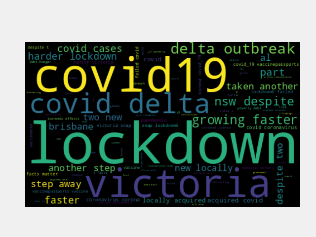
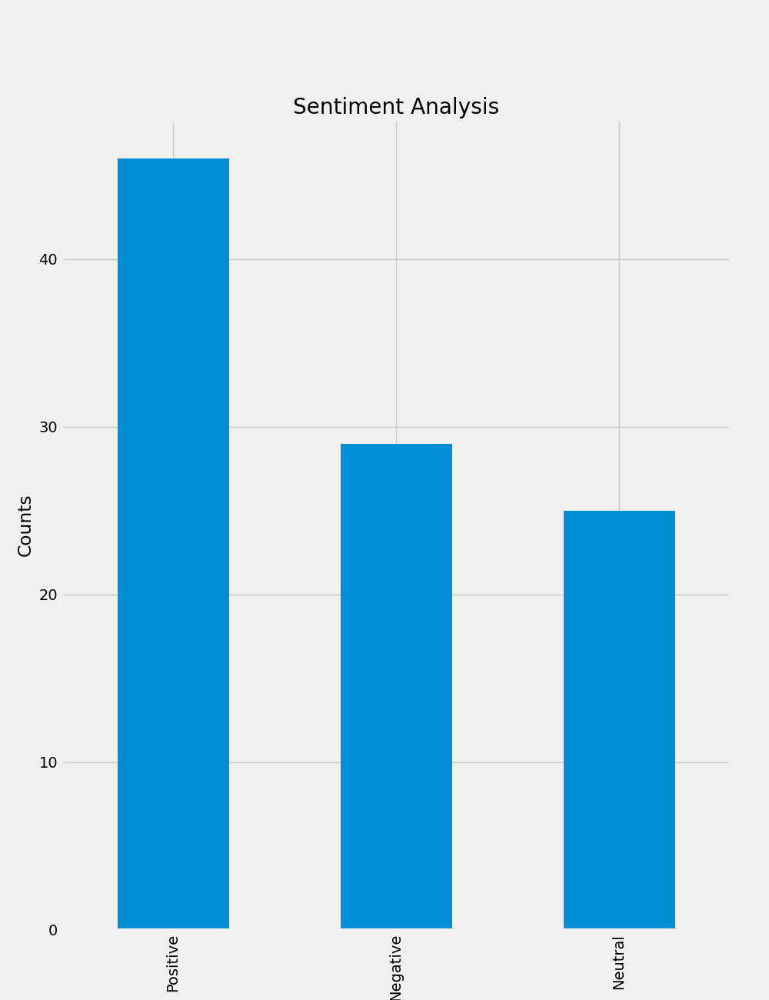
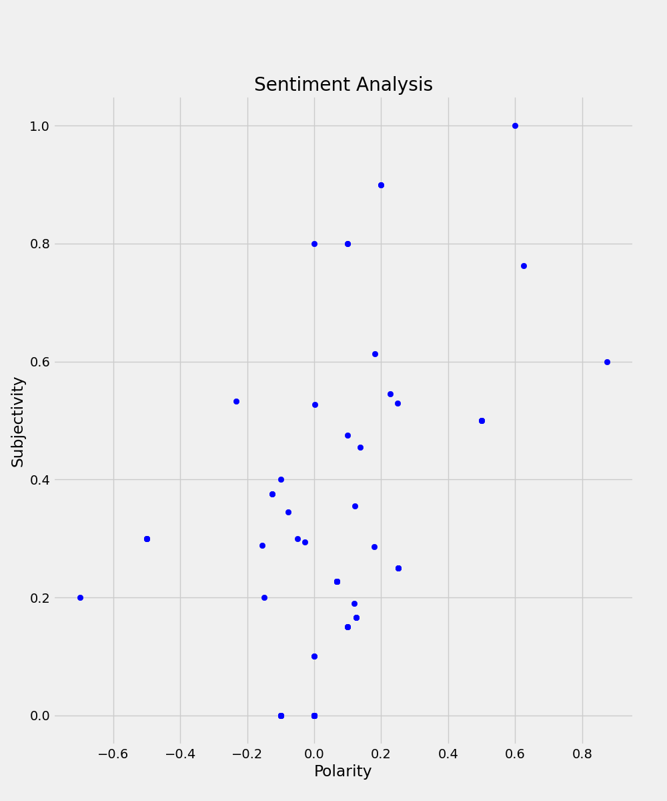

# Reto 2

## Complete
The complete code can be found on [`twitter_npl.py`](./twitter_npl.py)

## Statement
* (1). Desarrolle un pre-procesamiento que involucre tareas típicas, tales como:
  * Tokenizar
  - Eliminar stop-words (artículos, pronombres, preposiciones, etc)
  - Convertir a minúscula
  - Eliminar acentos
  - Eliminar caracteres especiales
  - Tratar con hashtags y otra simbología propia de Twitter
  - Procesar negaciones
  - Tratar URLs
  - Etc...

```python
# pre-procesor
def clean_tweet(tweet_text: str):
  # Removing @mentions
  tweet_text = re.sub(r'@[A-Za-z0-9]+', '', tweet_text)
  # Removing '#' hashtags
  tweet_text = re.sub(r'#', '', tweet_text)
  # Removing RT (ReTweets)
  tweet_text = re.sub(r'RT[\s]', '', tweet_text)
  # Removing URLs
  tweet_text = re.sub(r'https?:\/\/\S+', '', tweet_text)
  # Remove '
  tweet_text = tweet_text.replace("'", '')
  tweet_text = tweet_text.lower()
  return tweet_text

df['Tweets'] = df['Tweets'].apply(clean_tweet)
```

* (2). Desarrolle una transformación que involucre tareas típicas, tales como:
  - Lematizar
  - Stemming
  - -Etc...

```python
# -- Transformation
def get_words(text):
  return TextBlob(text).words.lemmatize()

# Word Cloud
df['Words'] = df['Tweets'].apply(get_words)
allwords = ' '.join([twts for twts in df['Tweets']]) # this one works better than lemmatize
#allwords = ' '.join([str(twts) for twts in df['Words']])
wc = WordCloud(width=500, height=300, random_state=21, max_font_size=119).generate(allwords)

# Statistics
plt.imshow(wc, interpolation='bilinear')
```

* (3). Minería de datos e Interpretación
  - Estadística descriptiva
  - Análisis de sentimientos

```python
# Sentiment Analysis
def get_subjectivity(text):
  return TextBlob(text).sentiment.subjectivity

def get_polarity(text):
  return TextBlob(text).sentiment.polarity

# more code ...

# function that compute the negative, neutral and positive analysis
def get_analysis(score):
  if score < 0:
    return 'Negative'
  elif score == 0:
    return 'Neutral'
  else:
    return 'Positive'

df['Analysis'] = df['Polarity'].apply(get_analysis)

log_info('Print all of the positive tweets')
sorted_df = df.sort_values(by=['Polarity'])
```

## Common words


## Sentiment analysis


## Polarity and subjetivity
